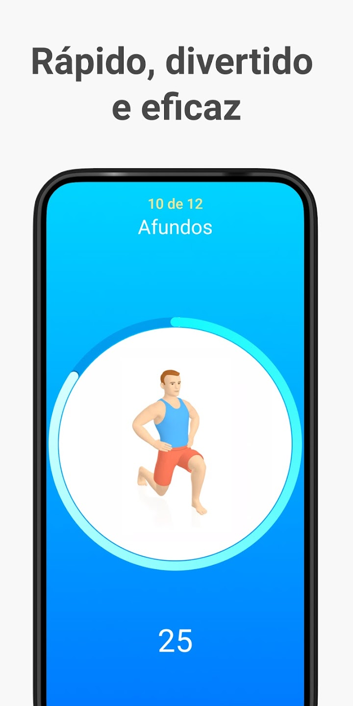
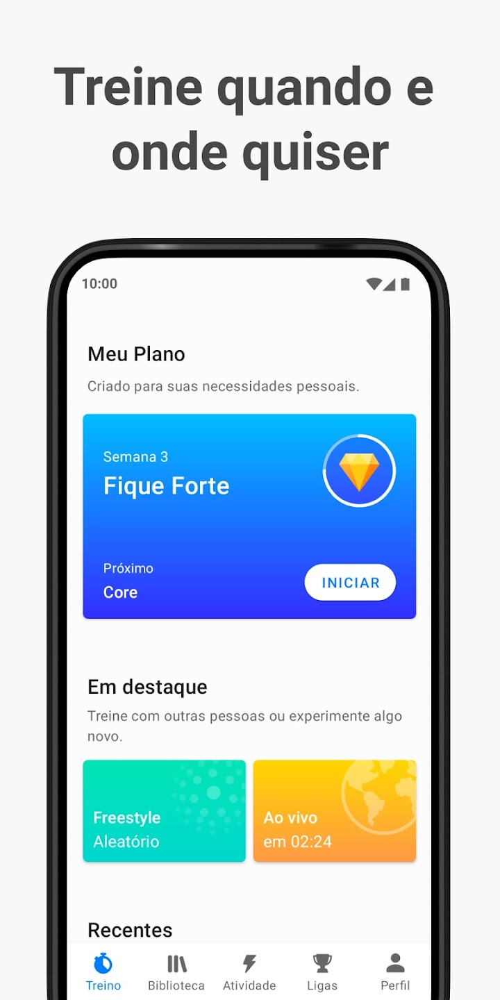
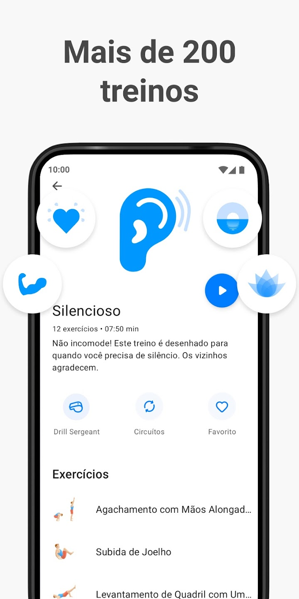
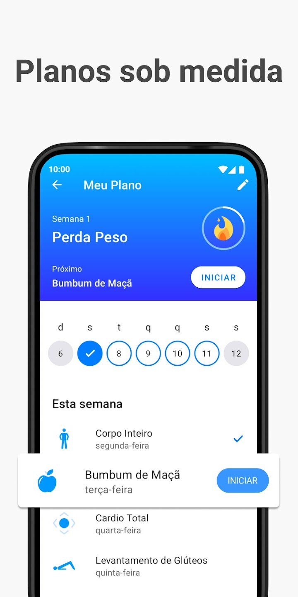

# Competitor Analysis: Application Seven 
## General Information 
- **Name of System:** Seven 
- **Company/Developer:** Perigee
- **Website/Product Page:** https://seven.app
- **Version/Release Date:** Version 9.20.06 released on November 11, 2024
- **Platform(s) Supported:** Mobile (iOS/Android)
- **Target Audience:** Busy people seeking short and effective workouts, home fitness enthusiasts, fitness novices, and travelers who need convenient workouts without the need to visit a gym.

--- 
## Core Functionality 

**Primary Purpose:** 
The app is designed to provide users with short and effective bodyweight workouts that can be done at home or anywhere convenient.

**Key Features:** 
- Personalized workouts: Individual workout plans designed for the user's fitness level, goals, and preferences.
- Customizable workout programs: The ability to choose exercises for different body parts or perform full-body comprehensive workouts. (Unfortunately, this mostly applies to the paid version of the app).
- Progress tracking: saving completed workouts (records which workouts were completed and on which days), an achievement system (users receive rewards for completing a certain number of workouts and challenges), and statistics and analytics (shows the total number of completed workouts and time spent). 

**Unique Selling Points (USPs):**

- Short workouts that easily fit into a busy schedule.

- Access to workouts anytime, anywhere without the need for equipment.

- Interactive elements and games that make workouts fun and engaging.

**Limitations/Weaknesses:** 

- Some users may find that the workouts are too short to achieve serious fitness goals.

- Limited variety of exercises compared to more advanced fitness apps. 

---

## Screenshots

 
 

## Online Reviews

Average app rating: 4.7/5 on the App Store and 4.6/5 on Google Play.

Negative reviews: Some users complain about limited free content, repetitive exercises, and the lack of advanced programs.

Positive reviews: Users like that the workouts are short and convenient, making them easy to fit into their schedule. The achievement and reward system helps keep them motivated, and they can exercise anywhere without equipment. Many also appreciate the simple and user-friendly interface, easy progress tracking, and a good selection of workout programs. 
