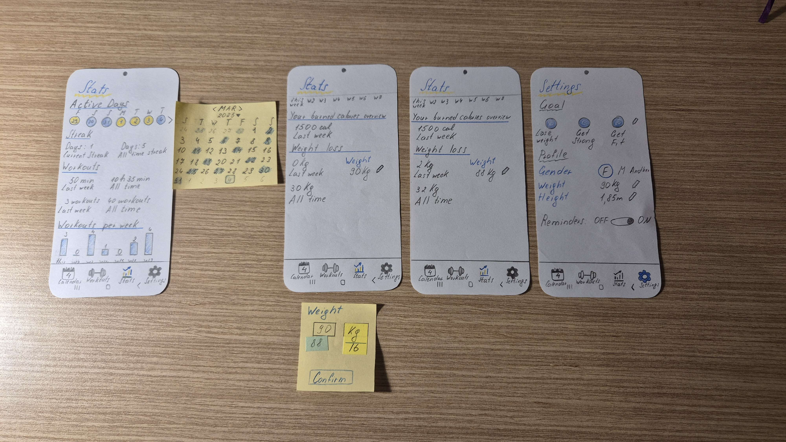

[Back to main Logbook Page](../hci_logbook.md)

---
# Low Fidelity Prototype and Evaluation

## D.1. Low Fidelity Prototype

### Task Nº 1 - Create a perfil with personal information

### Task Nº 2 - Schedule the "Full Cardio Workout" on a Monday at 17:30 with notifications.

### Task Nº 3 - Realize the "Full Body Workout", doing all exercises expect skiping a set of "Jumping Jacks".

### Task Nº 4 - Change the weight to 88 kg in statistics.

### Task Nº 5 - Create a workout with the name "Chest Workout" with the following exercises:
    -> Push Ups                 2 sets      12 reps     1:00 Rest
    -> Incline Dumbell Press    3 sets      15 reps     1:00 Rest
    -> Bench Press              3 sets      10 reps     1:30 Rest
 

## D.2. Prototype Evaluation

---
[Back to main Logbook Page](../hci_logbook.md)

---